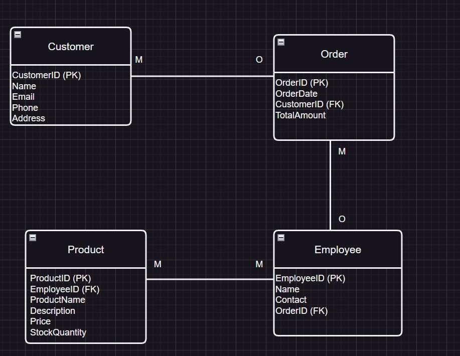

# BBT3104: Advanced Database Sytems Semester Project

| **Key**                                                               | Value                                                                                                                                                                              |
|---------------|---------------------------------------------------------|
| **Name of Business Chosen for the Case Study**                                                       | ? |
| **Industry**   
Davis & Shrtliff                                                    | ? |
| **Group Name** 
C03                                                              | ? |
| **Semester Duration**                                                 | 19th August - 25th November 2024                                                                                                                       |

# Cause-and-Effect Diagram

# Enhanced Entity Relationship Diagram (EERD)

# Database Schema

# System Architecture

